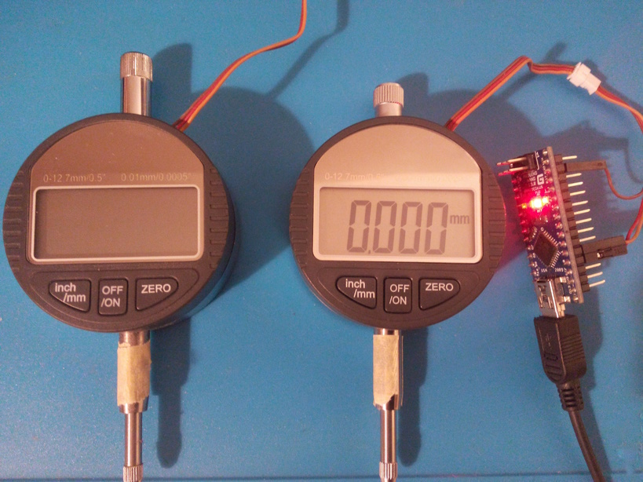

# dialIndicatorToSerial
Arduino based digital dial indicator (caliper) logger

# Usage:
1. connect your dial indicator (caliper) **DATA** and **CLOCK** outputs to analog inputs **A0** and **A1**
1. run program on your arduino board
1. open the arduino port monitor and set baud rate to **115200**

Tested on:
 - arduino nano (atmega328)
 - cheap Chinese digital dial indicator (12.7mm, 0.01mm precision)


# UART Output:
```
15052 ms 1.47 mm
15177 ms 1.52 mm
15302 ms 1.52 mm
15427 ms 1.83 mm
15552 ms -3.07 mm
...
18675 ms 0.1835 in
18800 ms 0.1820 in
18925 ms 0.1805 in
19074 ms 0.1780 in
```

# Related materials
1. program is based on http://wei48221.blogspot.tw/2016/01/using-digital-caliper-for-digital-read_21.html
1. https://hackaday.io/project/511-digital-dial-indicator-cnc-surface-probe


